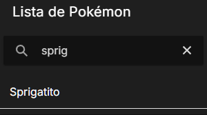
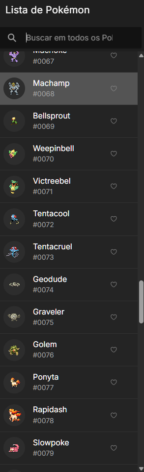
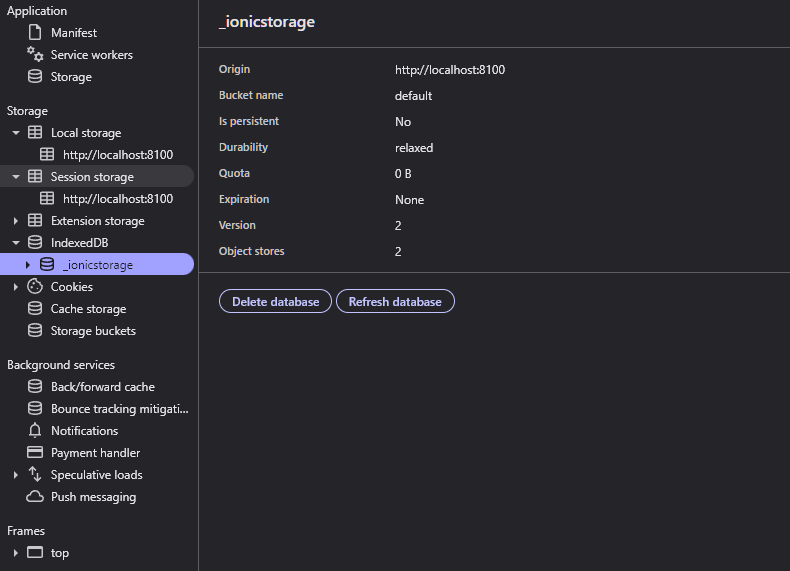
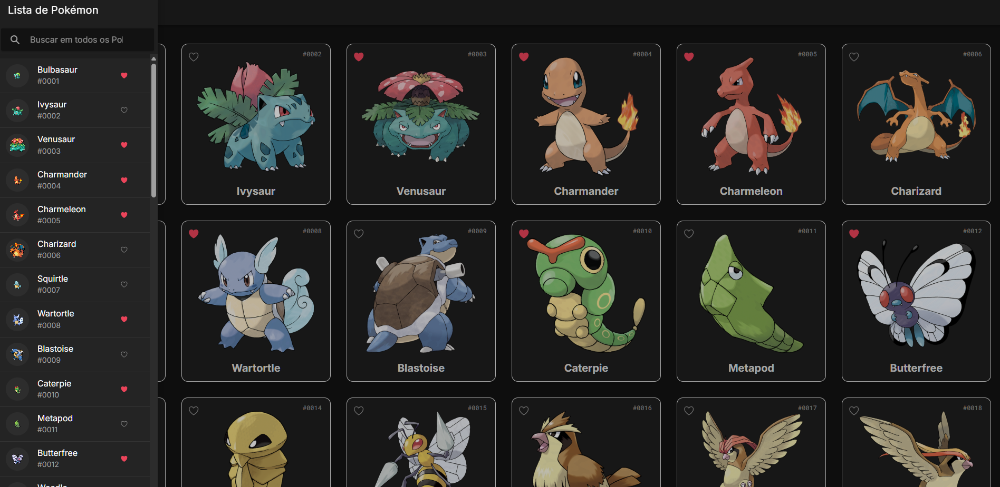
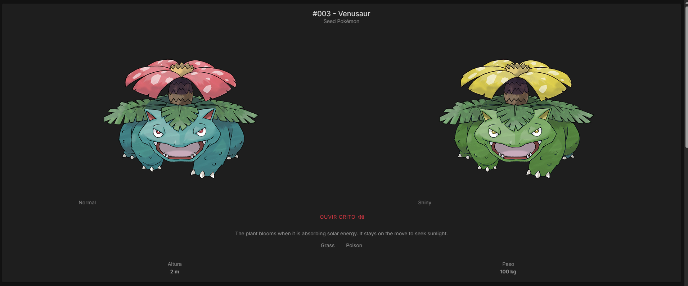
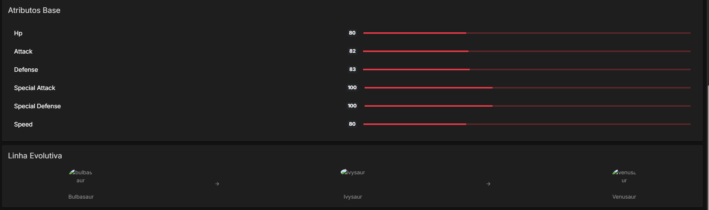
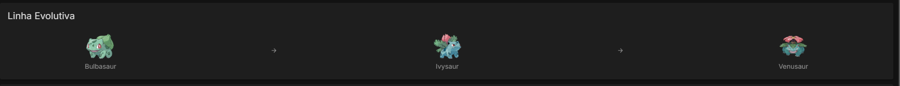
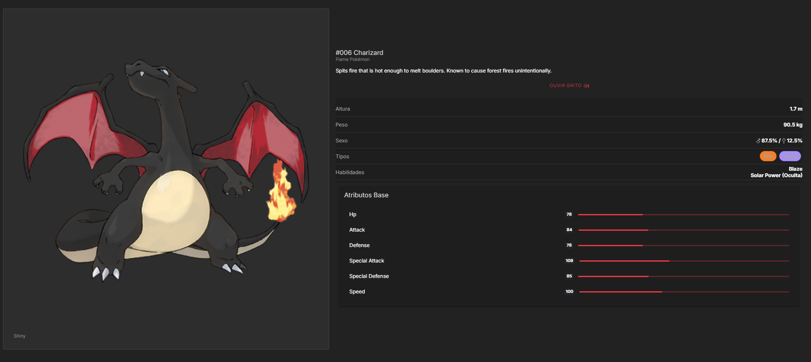
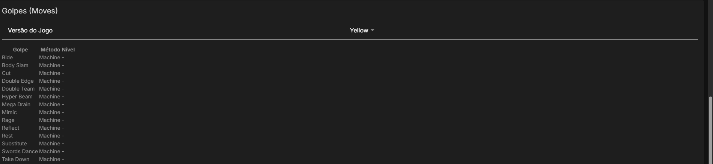

# Avaliação Técnica PokéAPI com Ionic/Angular

Olá! Este repositório contém o desenvolvimento da minha solução para a avaliação técnica de front-end, que consiste em criar uma Pokédex funcional utilizando **Ionic, Angular e a PokéAPI**.

O objetivo é demonstrar não apenas a implementação das funcionalidades solicitadas, mas também a aplicação de boas práticas de desenvolvimento, como componentização, arquitetura de serviços, commits semânticos e responsividade.

## ✅ Funcionalidades Implementadas

| Funcionalidade         | Status      | Detalhes                                                                                       |
|-----------------------|-------------|------------------------------------------------------------------------------------------------|
| Listagem de Pokémon   | ✅ Concluído | Grid responsivo que exibe imagem, nome, ID e tipo de cada Pokémon.                             |
| Paginação             | ✅ Concluído | Controles para navegar entre as páginas da Pokédex.                                            |
| Sistema de Favoritos  | ✅ Concluído | Permite favoritar/desfavoritar Pokémon na listagem. O estado é salvo no localStorage.          |
| Busca Otimizada       | ✅ Concluído | Campo de busca que consulta uma base local (Ionic Storage) para resposta instantânea.           |
| Página de Detalhes    | ✅ Concluído | Rota dinâmica (/pokemon/:name) que exibe um perfil completo e rico em informações.             |
| Filtragem de Golpes   | ✅ Concluído | Na tela de detalhes, é possível filtrar a lista de golpes por versão do jogo.                  |

🧠 Decisões de Arquitetura
Durante o desenvolvimento, algumas decisões foram tomadas para melhorar a performance e a experiência do usuário:

Cache para a Busca: Em vez de pesquisar apenas na lista de Pokémon visível na tela, optei por carregar a lista completa de nomes de Pokémon uma única vez e salvá-la localmente com Ionic Storage. Isso resultou em uma busca instantânea e altamente performática, mesmo para Pokémon que ainda não foram exibidos na tela principal.

Orquestração de Chamadas com RxJS: A tela de detalhes necessita de informações de múltiplos endpoints da API (/pokemon, /pokemon-species, /evolution-chain). Para gerenciar isso de forma eficiente, utilizei operadores do RxJS como switchMap e map para criar um fluxo de dados reativo, que busca e combina todas as informações necessárias antes de renderizar a tela.

Filtragem de Dados no Front-End: A lista de golpes de um Pokémon é massiva e varia muito entre os jogos. Em vez de exibir uma tabela poluída e repetitiva, implementei uma lógica de filtragem no componente que processa os dados e exibe uma lista limpa e contextualizada para o usuário, melhorando significativamente a UX.

## Histórico de Implementações

Neste momento, a arquitetura base do projeto está finalizada e a tela principal já consome a PokéAPI, exibindo a listagem inicial dos Pokémon de forma componentizada e responsiva.

### Sistema de Favoritos

Meu foco atual é a implementação de uma das funcionalidades centrais: o **sistema de favoritos**.

No commit `Feat: Adicionando o favorite.service para salvar os favoritos`, iniciei o desenvolvimento do `favorite.service`, responsável por gerenciar a lógica de adicionar e remover Pokémon da lista de favoritos. Utilizo o **`localStorage` do navegador** para garantir que as escolhas do usuário persistam entre sessões.

    

Esse serviço habilita a interatividade nos cards dos Pokémon e serve de base para a futura tela de "Meus Favoritos".

### Tema e Paginação

Adicionei um tema padrão ao projeto e implementei a paginação conforme descrito no enunciado.

    

### Navegação e Detalhes

Inicialmente, planejei manter todas as informações em um modal na home, mas, conforme solicitado, implementei o redirecionamento de rota. Agora, ao clicar em um Pokémon, o usuário é levado para `/pokemon/nome-do-pokemon`.

    

### Barra de Pesquisa Otimizada

Implementei uma barra de pesquisa. No início, ela pesquisava apenas nos Pokémon já carregados na lista, o que era ineficiente. Para otimizar, utilizei o **Ionic Storage** para salvar localmente os nomes dos Pokémon, permitindo buscas instantâneas, mesmo para Pokémon ainda não exibidos.

    
    
    

Antes, era necessário carregar a lista várias vezes; agora, a busca ficou muito mais eficiente.

### Sincronização de Favoritos

Mesmo impedindo a paginação, o botão de favorito (coração) parou de funcionar temporariamente, mas está sincronizado com a lista.

    

O problema estava em um SCSS duplicado. Para sincronizar as listas de favoritos em diferentes componentes, considerei utilizar o NgRx, mas priorizei o desenvolvimento da página de informações.

### Página de Detalhes Aprimorada

A página de detalhes do Pokémon foi aprimorada com:

- Sprite shiny
- Som do grito do Pokémon
- Atributos base
- Linha evolutiva
- Golpes filtrados por versão do jogo

    

A linha evolutiva ainda apresenta um desafio: tentei utilizar o ID da foto para evitar uma requisição extra, mas avalio ajustar ou realizar novas requisições para melhorar.

Consegui arrumar.

|  |  |
|:----------------------------------:|:----------------------------------:|
| Linha evolutiva                    | Linha evolutiva                    |

### Exibição dos Moves

Estou avaliando a melhor forma de exibir os moves, pois consegui puxar os golpes de cada versão do jogo, mas a apresentação ainda não está ideal.

### Melhorando a usabilidade
Comecei a refatorar o html da pokemons detail.

    

    

