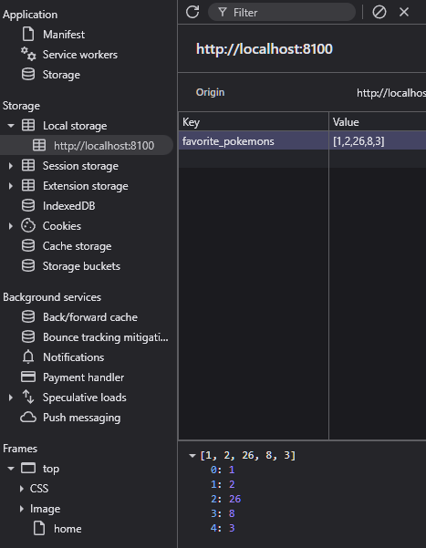
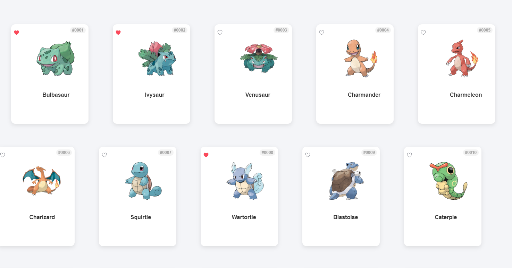
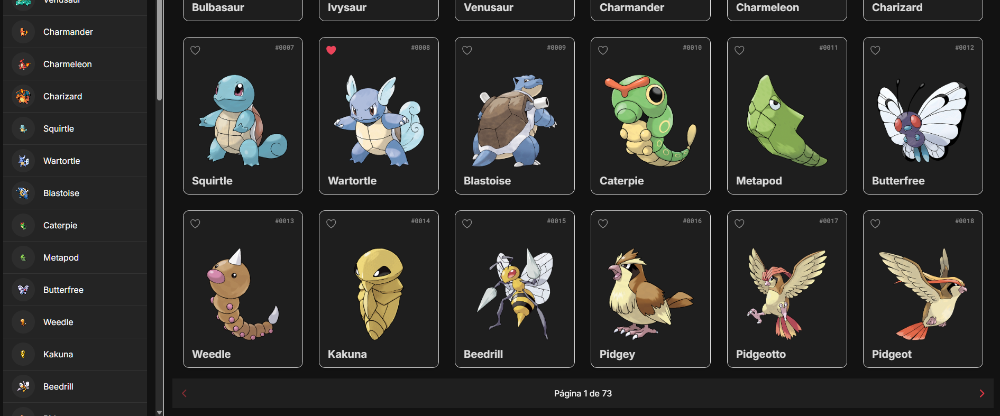
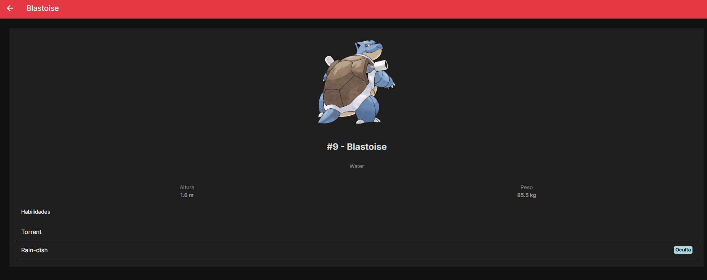

# Avaliação Técnica PokéAPI com Ionic/Angular

Olá! Este repositório contém o desenvolvimento da minha solução para a avaliação técnica de front-end, que consiste em criar uma Pokédex funcional utilizando **Ionic, Angular e a PokéAPI**.

O objetivo é demonstrar não apenas a implementação das funcionalidades solicitadas, mas também a aplicação de boas práticas de desenvolvimento, como componentização, arquitetura de serviços, commits semânticos e responsividade.

## Status do Projeto

Aqui está um resumo do progresso atual, baseado nas funcionalidades solicitadas na descrição da vaga:

| Funcionalidade | Status | Descrição |
| :--- | :---: | :--- |
| **Tela Principal Responsiva** | ✅ Concluído | Exibe uma lista/grid de Pokémon com imagem, nome e ID. |
| **Consumo da PokéAPI** | ✅ Concluído | O app busca e exibe os dados da API com sucesso. |
| **Sistema de Favoritos** | 🚧 Em Andamento | Lógica para favoritar/desfavoritar e persistência de dados. |
| **Tela de Detalhes** | ⏳ A Fazer | Exibirá informações detalhadas de cada Pokémon. |
| **Busca e Filtragem** | ⏳ A Fazer | Campo de busca para encontrar Pokémon por nome. |
| **Paginação** | ⏳ A Fazer | Controles para navegar entre as páginas da lista. |
| **Boas Práticas** | ✅ Concluído | Commits claros, injeção de dependência e estrutura organizada. |

---

## Onde Estou no Projeto?

Neste momento, a arquitetura base do projeto está finalizada e a tela principal já consome a PokéAPI, exibindo a listagem inicial dos Pokémon de forma componentizada e responsiva.

Meu foco atual é a implementação de uma das funcionalidades centrais: o **sistema de favoritos**.

Conforme meu último commit (`Feat: Adicionando o favorite.service para salvar os favoritos`), estou desenvolvendo o `favorite.service`. Este serviço será o responsável por gerenciar a lógica de adicionar e remover Pokémon da lista de favoritos, utilizando o **`localStorage` do navegador** para garantir que as escolhas do usuário persistam entre as sessões.

Este passo é para habilitar a interatividade nos cards dos Pokémon e criar a base para a futura tela de "Meus Favoritos".

Adicionado tema padrão, paginação conforme descrito no enunciado.

Minha ideia era utilizar somente a home e manter as informações em um modal, mas como foi solicitado que tenha redirencionamento da rota, adicionei ao clicar no pokemon ir para /pokemon/nome-do-pokemon.

## Próximos Passos

Após finalizar o serviço de favoritos e integrá-lo à interface, meus próximos passos serão:

1.  Desenvolver a **Tela de Detalhes**, que será acessada ao clicar em um Pokémon.
2.  Implementar a **funcionalidade de busca** na tela principal.
3.  Adicionar os controles de **paginação** para uma navegação fluida.
4.  Criar a tela dedicada a exibir apenas os Pokémon favoritados.

Obrigado por analisar meu projeto! Estou à disposição para qualquer dúvida.